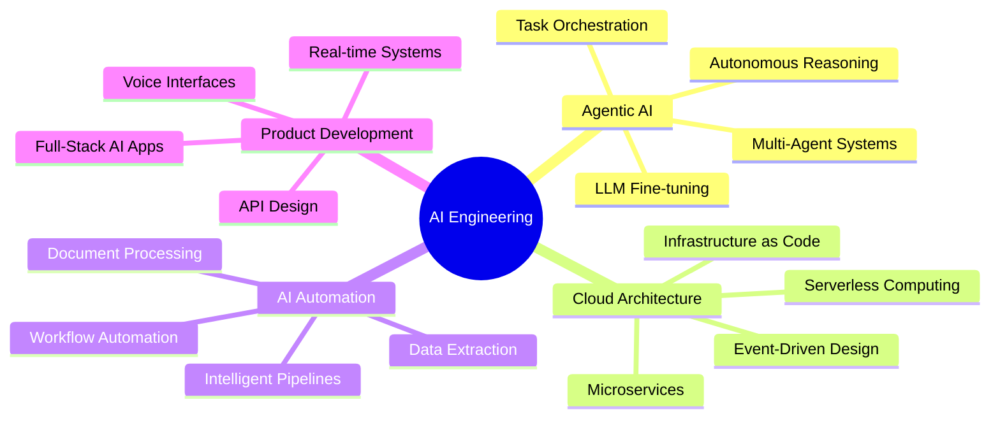

<div align="center">

<!-- Animated Header -->


<!-- Typing Animation -->
<a href="https://git.io/typing-svg"></a>

<p align="center">
  
  
  
</p>

</div>

---

<div align="center">

## 🎯 What I Build

</div>

<table align="center">
<tr>
<td width="50%" valign="top">

### 🤖 Intelligent Agent Systems
Production-ready AI agents that autonomously reason, plan, and execute complex workflows. From conversational assistants to multi-agent orchestration.

**Recent Work:**
- Multi-modal AI agents with voice & chat
- RAG-powered knowledge systems
- Autonomous task execution frameworks

</td>
<td width="50%" valign="top">

### ☁️ Scalable AI Infrastructure
Cloud-native architectures that power AI at scale. Designing systems that handle millions of requests while keeping costs optimized.

**Capabilities:**
- Serverless AI deployments
- Container orchestration for ML
- Real-time streaming pipelines

</td>
</tr>
<tr>
<td width="50%" valign="top">

### ⚡ AI-Powered Automation
Intelligent automation that goes beyond rules. Systems that learn, adapt, and optimize business workflows automatically.

**Solutions:**
- Document processing with LLMs
- Intelligent data extraction
- Workflow orchestration engines

</td>
<td width="50%" valign="top">

### 🏗️ Enterprise AI Products
Full-stack AI applications from concept to production. Building products that solve real business problems with measurable ROI.

**Delivered:**
- Conversational AI platforms
- Analytics & insights engines
- Custom AI integrations

</td>
</tr>
</table>

---

<div align="center">

## 🚀 Featured Work

</div>

<div align="center">

[](https://github.com/Amdev-5/ai-conversational-agents)

</div>

<details>
<summary><b>🎯 Project Highlights</b></summary>
<br/>

**Company Research Assistant**
- Autonomous research agent using Google Gemini
- Real-time progress tracking & streaming
- 8-section comprehensive account plans
- Voice + Chat dual-mode interface

**Interview Practice Partner**
- Dynamic question generation with context
- Intelligent feedback analysis
- 6 different role simulations
- Multi-turn conversation handling

**Technical Excellence:**
```python
stack = {
    "Backend": "FastAPI (Async/Await patterns)",
    "AI": "Google Gemini 2.0 Flash Lite",
    "Frontend": "Vanilla JS (No framework overhead)",
    "Voice": "Web Speech API integration",
    "Architecture": "Event-driven, stateless design"
}
```

</details>

---

<div align="center">

## 💼 Technical Arsenal

</div>

### AI & Machine Learning
<p align="center">


</p>

### Cloud & Infrastructure
<p align="center">


</p>

### Development Stack
<p align="center">


</p>

---

<div align="center">

## 📊 Impact & Metrics

</div>

<p align="center">
  
  
</p>

<p align="center">
  
</p>

---

<div align="center">

## 🎓 Expertise Areas

</div>



---

<div align="center">

## 💡 What I'm Building Now

</div>

<table align="center">
<tr>
<td width="33%" align="center">

### 🔬 Research
Exploring advanced multi-agent collaboration patterns and LLM optimization techniques

</td>
<td width="33%" align="center">

### 🛠️ Development
Building autonomous AI frameworks that solve complex enterprise workflows

</td>
<td width="33%" align="center">

### 📚 Learning
Deep diving into edge AI, model compression, and neuromorphic computing

</td>
</tr>
</table>

---

<div align="center">

## 🏆 Achievements That Matter

</div>

<p align="center">

🥇 **National Level Powerlifter** – Discipline translates to code<br/>
🎓 **B.Tech Computer Science** – VIT Vellore<br/>
🚀 **Production AI Systems** – Serving real users at scale<br/>
💼 **Enterprise Solutions** – Built systems processing millions of requests<br/>
🌟 **Open Source Contributor** – Giving back to the community<br/>

</p>

---

<div align="center">

## 🔗 Let's Connect

</div>

<p align="center">
  <a href="https://www.linkedin.com/in/amitkumar0501/">
    
  </a>
  <a href="mailto:amitkumarwork.io@gmail.com">
    
  </a>
  <a href="https://github.com/Amdev-5">
    
  </a>
  <a href="https://leetcode.com/hitman_45/">
    
  </a>
</p>

---

<div align="center">

## 💼 Open to Opportunities

</div>

<table align="center">
<tr>
<td width="33%" align="center">

### 🤝 Consulting
AI strategy and implementation for forward-thinking companies

</td>
<td width="33%" align="center">

### 💻 Contract Work
Building production AI systems with proven architectures

</td>
<td width="33%" align="center">

### 🚀 Full-time Roles
AI Engineering positions at innovative organizations

</td>
</tr>
</table>

<div align="center">

**Interested in working together?**

*I'm always excited to discuss challenging AI problems and innovative solutions.*

[](mailto:amitkumarwork.io@gmail.com)

</div>

---

<div align="center">

### 💭 Philosophy

*"The best AI systems are invisible – they just work."*

Building intelligent systems that solve real problems, not just tech demos.<br/>
Every line of code serves a purpose. Every architecture decision is intentional.

</div>

---

<div align="center">

### 📈 Contribution Graph


</div>

---

<div align="center">

### ⚡ Quick Facts

</div>

- 🔭 Currently architecting **multi-agent AI systems** for enterprise automation
- 🌱 Exploring **edge AI** and **model optimization** techniques
- 💬 Ask me about **LLM integration**, **cloud architecture**, or **agentic AI**
- 🎯 2025 Goal: Ship **10+ production AI products** that create measurable value
- ⚡ Fun fact: I apply **progressive overload** from powerlifting to skill development
- 🧠 Passion: Making AI **accessible, practical, and impactful** for real-world use

---

<div align="center">

### 🎨 Tech Stack Visualization


</div>

---

<div align="center">


</div>

<!--
Professional Note: This profile represents production-ready skills and real-world experience.
Every project showcased is battle-tested and serves actual users.

Looking for someone who can architect, build, and ship AI products? Let's talk.
-->
